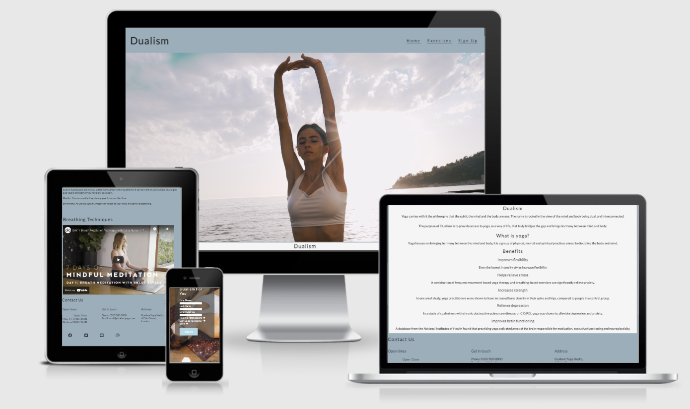
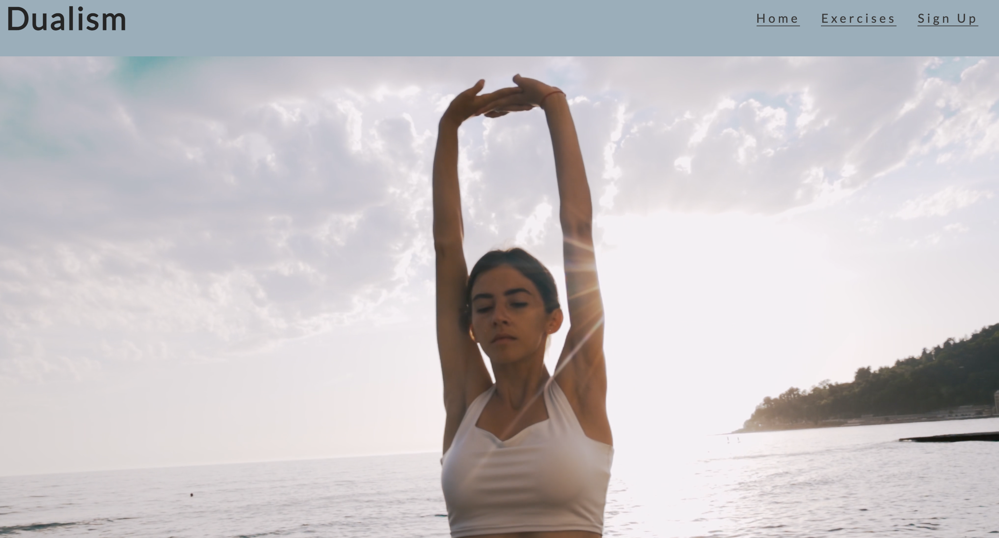
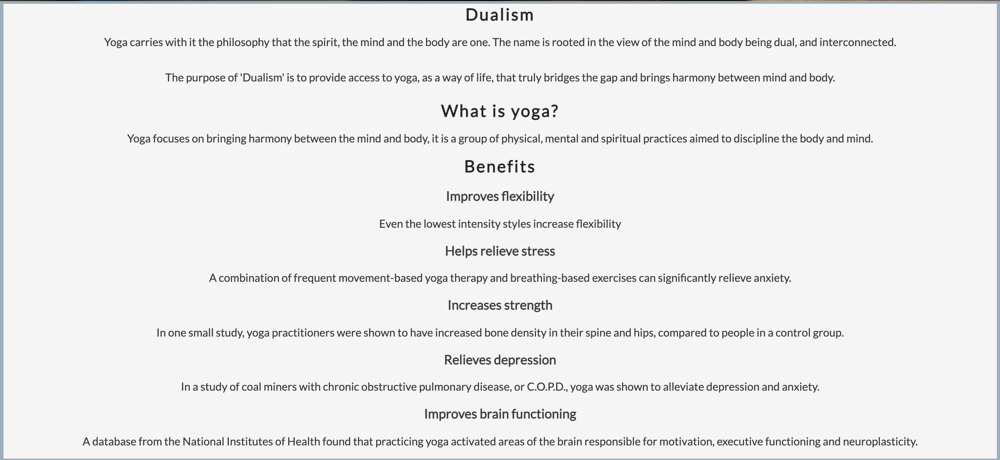
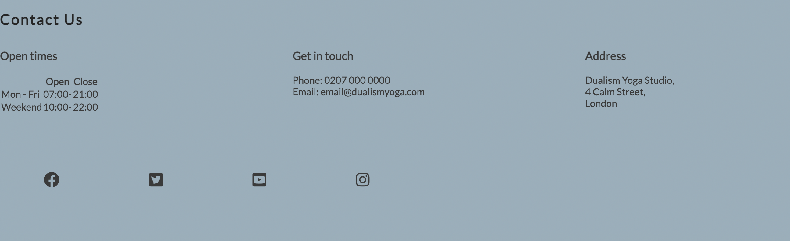

# Dualism

Dualism is a platform for individuals of all ages,abilities and walks of life to pursue wellness through yoga. This website will provide users with information about yoga, exercises and personalized content (upon subscription). There is also information about how to contact us, whether to ask questions or walk-in to one of our studios. 

## Features
### Navigation

* At the top of the page, it shows the website logo in the left corner ‘Dualism’ that links to the home page
* The other navigation links are Home, Exercises and Sign Up which link to different pages, which makes the information easy to find
* The font is clean, clear and has a calming effect that correlates with the theme 

### About Us 

It explains what yoga is, the purpose of the website and explains the benefits of incorporating yoga into the user’s life.

### Sign Up Form

* This sign up section is a form to find out the user’s name, email address and method of sending them updates and further content 
* The sign  up form is valuable to the user as it gives them an opportunity to sign up for updates and more information, and techniques for wellness. 

### Contact Us 

* The contact section encourages users to get in contact. It provides an address, phone number, and email address alongside opening hours. 
* It also includes social media icons that allow users to follow
* This section is valuable to the user as it gives the ability to find, follow and contact ‘Dualism’ 

## Testing
* I tested to make sure the page works in different browsers: Safari, Chrome, Firefox
* I have confirmed that this project is responsive, and functions on all standard screen sizes
* I have confirmed that all the navigation, headers, about us, and contact are all readable and easy to understand
* I have confirmed that the form works, requires entries in every field, will only accept an email and the submit button works

### Validator Testing
* HTML - No errors were returned when passing through the official W3C validator
* CSS - No errors were found when passing through the official (

Accessibility:
![Lighthouse results]

* Using lighthouse in devtools, I confirmed that the colors and fonts chosen are easy to read and accessible 

### Unfixed bugs
No unfixed bugs 

## Deployment
The site was deployed to GitHub pages. The steps to deploy are as follows:
1. In the GitHub repository, navigate to the Settings tab
2. From the source section drop-down menu, select the Master Branch
3. Once the master branch has been selected, the page will be automatically refreshed with a detailed ribbon display to indicate the successful deployment.

The live link can be found here - https://sabrinatam.github.io/dualism-project/

## Credits

### Content
* Instructions on how to implement a form on the Sign Up page was taken from the Love Running Walkthrough
* The icons in the footer were taken from [Font Awesome](https://fontawesome.com/)

### Media
* Images and videos were taken from [Pexels](https://www.pexels.com/)
* Breathing exercise video taken from [Youtube](https://www.youtube.com/watch?v=HGGI5GXXzz4&t=3s)

